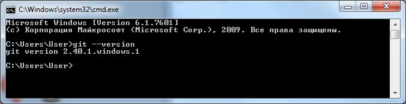

[<к содержанию](./readme.md)

# Установка GIT 

Для установки GIT перейдите на официальный сайт [https://git-scm.com/download](https://git-scm.com/download), скачайте подходящий дистрибутив и следуйте инструкциям.

## Установка в Windows
---
Проверка наличия GIT в командной строке:

`> git --version`

Если GIT уже был установлен, вам отобразится его версия:

## Установка в LInux
---

Проверка наличия GIT в терминале:

`> $ git --version`

Если вы хотите установить GIT под Linux как бинарный пакет, это можно сделать, используя обычный менеджер пакетов вашего дистрибутива. Если у вас Fedora (или другой похожий дистрибутив, такой как RHEL или CentOS), можно воспользоваться dnf:

`$ sudo dnf install git-all`

Если же у вас дистрибутив, основанный на Debian, например, Ubuntu, попробуйте apt:

`$ sudo apt install git`

Чтобы воспользоваться дополнительными возможностями, посмотрите инструкцию по установке для нескольких различных разновидностей Unix на [сайте GIT](https://git-scm.com/download/linux).

